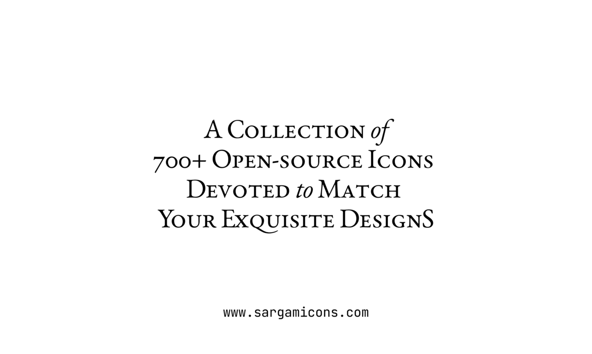

# Sargam Icons
A collection of 700+ open-source icons devoted to match your exquisite designs.

Every single detail in each icon is tuned to present minimalism & elegance. Each icon is designed on a 24x24 grid emphasising simplicity, consistency, & flexibility. With 700+ icons, Sargam covers the essential needs for your app, web and graphic needs.

1. 700+ free, open-source icons available for any use.
2. Designed on a 24x24 (@0.5x for 48px) grid.
3. Graceful design with emphasis on simplicity and consistency.
4. Built using SVG stroke giving maximum flexibility on styling.
5. Optimized SVGs for web usage.
6. Figma library and individual SVG files.
   

- [Sargam Icons](https://sargamicons.com/)

- [Get a Figma copy](https://www.figma.com/community/file/1152296792728333709)

- [Download SVGs](https://github.com/planetabhi/sargam-icons/tree/main/Icons)

- [NPM install; npm i sargam-icons](https://www.npmjs.com/package/sargam-icons)

- [Follow for updates; @SargamDesign](https://twitter.com/SargamDesign)